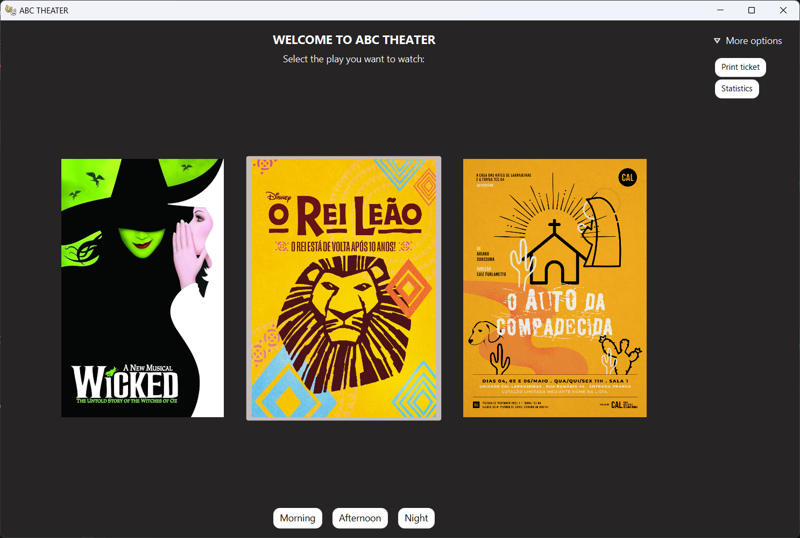
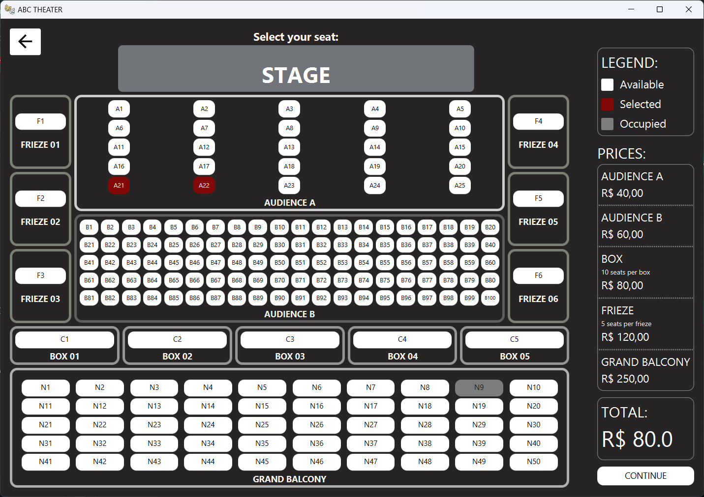
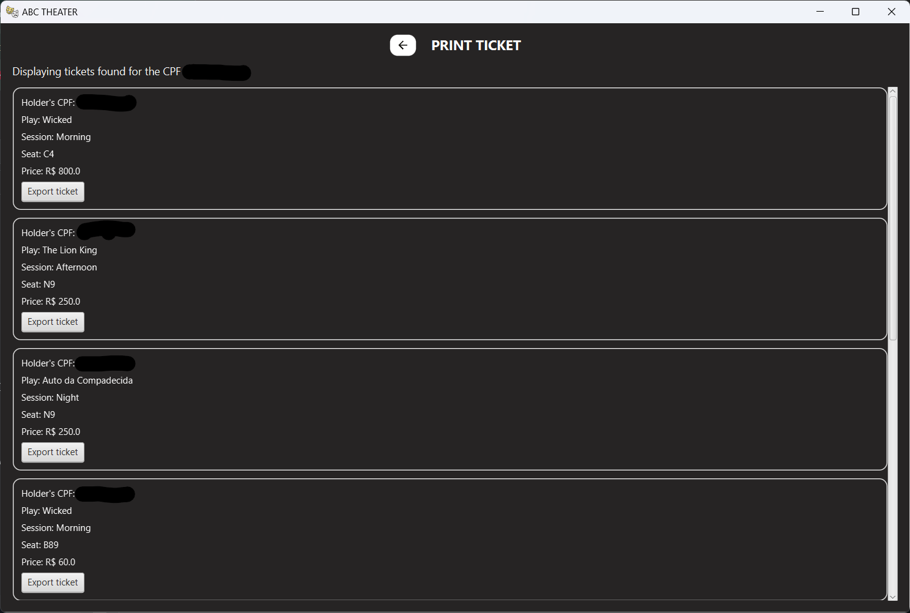
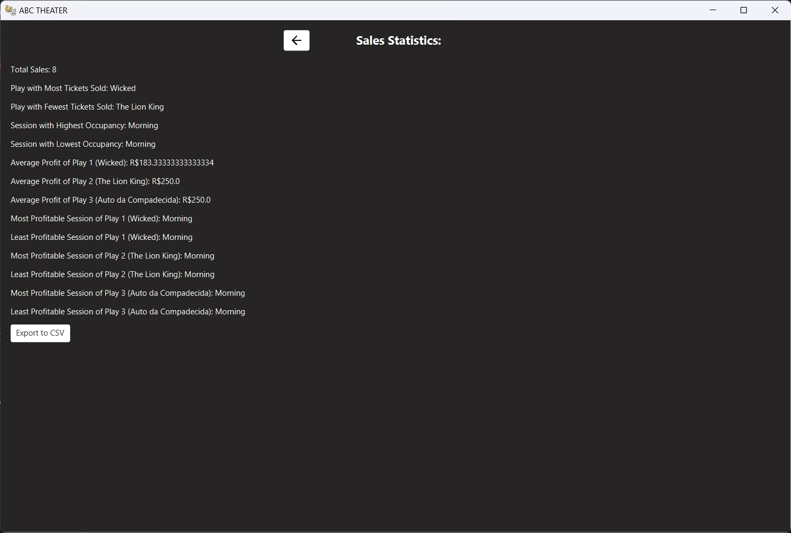

# Theater booking system

This project allows users to purchase tickets for 3 plays at a theater, print them, and generate statistics based on sales. 

## Functionalities

- **Buy Tickets**: Users can choose from three plays (Wicked, The Lion King and Auto da Compadecida, by default), available in three shifts, and reserve seats.
- **Choose different areas**: The theater has five distinct areas (Audience A, Audience B, Frieze, Box, and Grand Balcony), each with different prices and seat availability for the user to choose from.
- **Print ticket**: Users can enter their CPF (Brazilian tax ID) and view all the tickets they've purchased.
- **Show stats**: The system provides general sales statistics for the theater as well as individual stats for each play.
- **Export data**: Users can easily export both their bought tickets and the theater's sales statistics to a `.csv` file.

## Screenshots









## Installing

### Prerequisites

- Java 23 or newer installed.

### How to Install
#### IDE Setup
1. Make sure Git is installed.
2. Go to the directory where you want the project folder to be.
3. Clone the repository:
```bash
  git clone https://github.com/muriloonunes/theater-booking-system.git
```
4. Open the project in your preferred IDE.

## Made with

- **Java**: Robust, object-oriented programming language.
- **JavaFX**: Framework for building modern, responsive graphic interfaces.
- **SceneBuilder**: Visual tool for creating and organizing JavaFX interfaces.

## Authors

- **Murilo Nunes** [muriloonunes](https://github.com/muriloonunes/)
- **Hartur Sales** [hartur-sales](https://github.com/hartur-sales)
- **Davy Lopes** [DavyL0](https://github.com/DavyL0)
